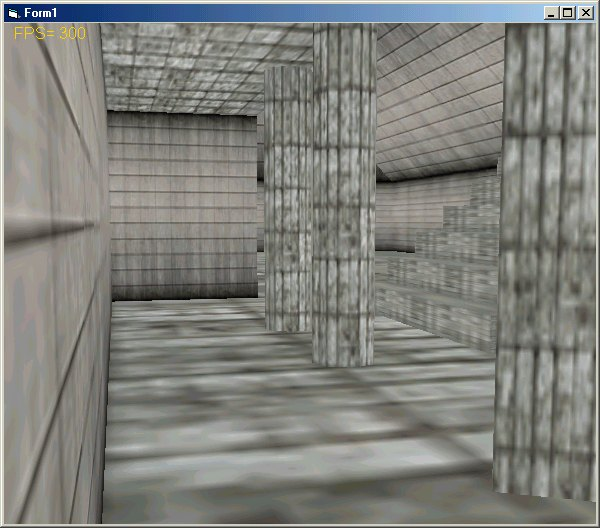



## DirectX8 Engine collision detection Demo

### Description

This little demo shows how it easy

to create quickly world indoor level with

sliding collision detection

this is a new version of the NemoX engine
 
### More Info
 

             |
---                |---
**Submitted On**   |2002-09-25 03:36:02
**By**             |[polaris](https://github.com/Planet-Source-Code/PSCIndex/blob/master/ByAuthor/polaris.md)
**Level**          |Intermediate
**User Rating**    |4.0 (28 globes from 7 users)
**Compatibility**  |VB 4\.0 \(32\-bit\), VB 5\.0, VB 6\.0
**Category**       |[DirectX](https://github.com/Planet-Source-Code/PSCIndex/blob/master/ByCategory/directx__1-44.md)
**World**          |[Visual Basic](https://github.com/Planet-Source-Code/PSCIndex/blob/master/ByWorld/visual-basic.md)
**Archive File**   |[DirectX8\_E1365639262002\.zip](https://github.com/Planet-Source-Code/polaris-directx8-engine-collision-detection-demo__1-39283/archive/master.zip)

